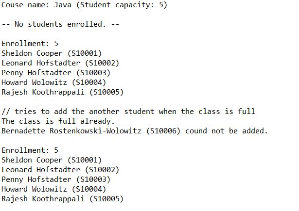

## Course Registration
Language: Java  
Wrote classese to create student accounts and classes, 
then a driver program to demonstrate how to add and drop students to the courses' roster.

 

  

#### Part 1- The Student Class
Write a class called Student.

#### Part 2- The Course Class  
Write a class called Course to represent a college class. 

#### Part 3- The Roster
Add a roster to the Course class. A roster is represented by an array of Student objects.

#### Part 4- Course Methods
Write methods to add and drop student and print the roster in the Course class:

#### Part 5- Driver Program 
Write a driver to demonstrate that your class works. 
 
 
###
### Bonus: 
Write a class called CourseAL. And instead of using an array to store the roster, use an ArrayList. 

